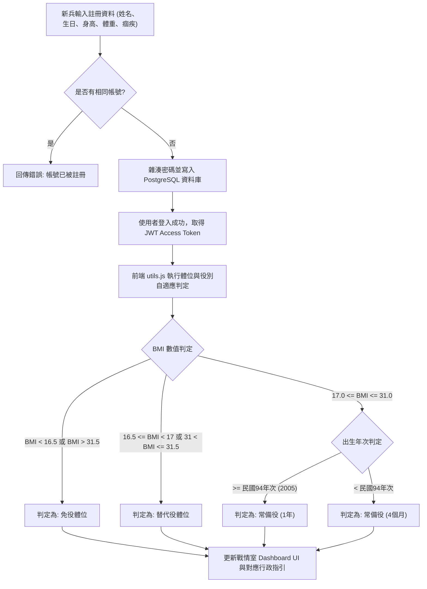
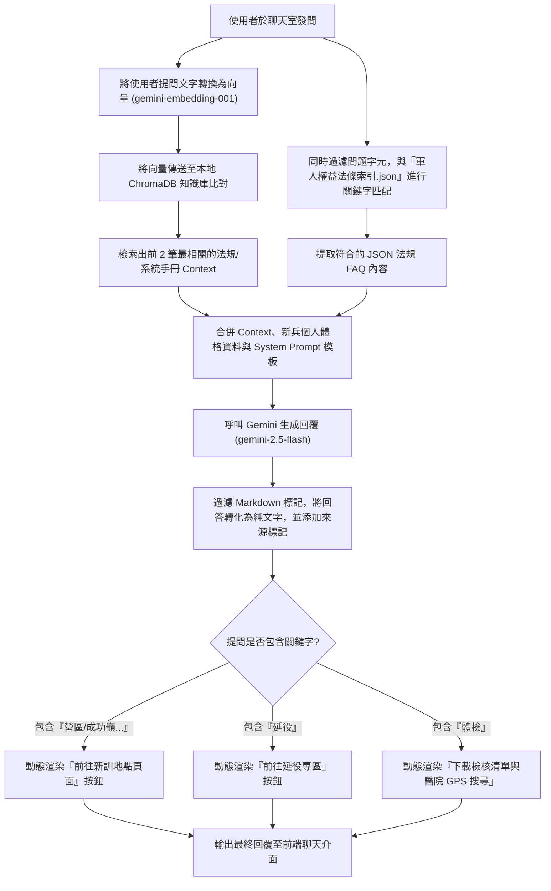
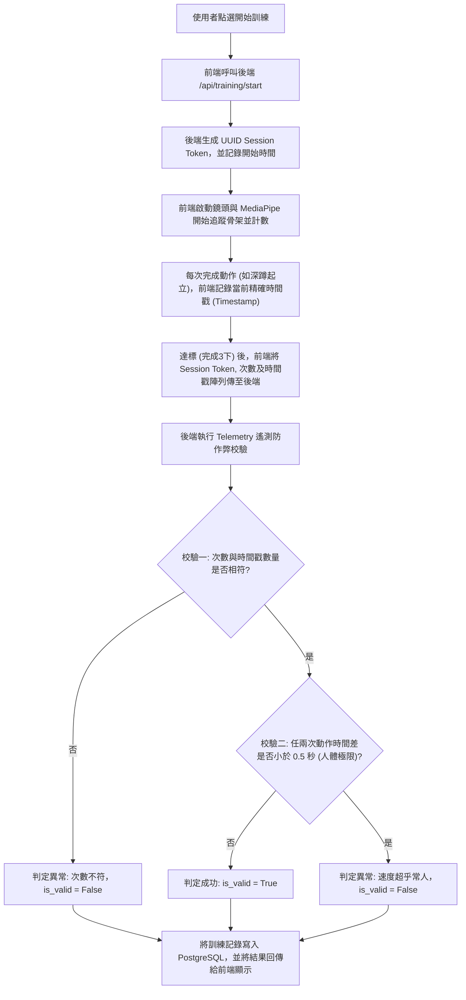
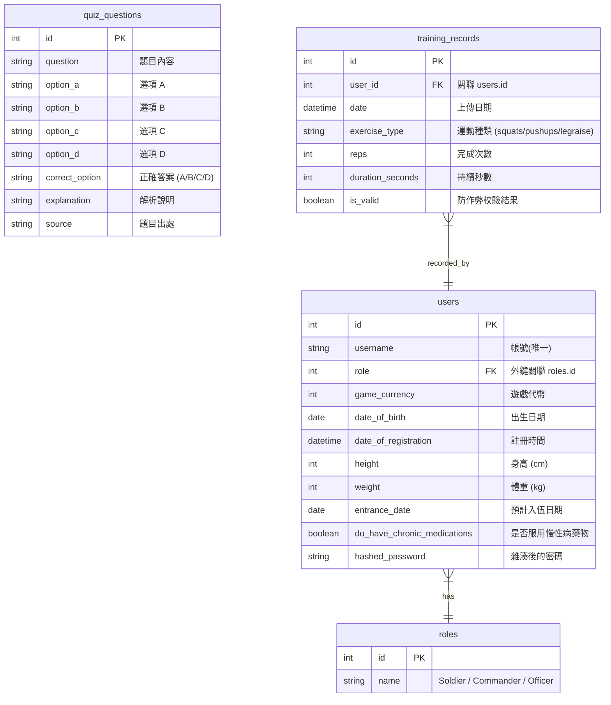
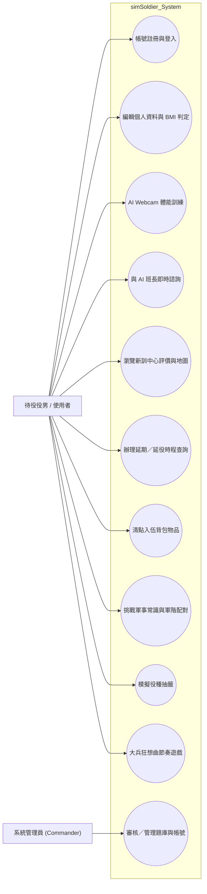

# simSoldier 新兵模擬與役政諮詢系統：專題研究報告與系統開發文件

---

## 目錄

- [壹、緒論](#壹緒論)
  - [1-1 背景介紹](#1-1-背景介紹)
  - [1-2 專題的目的及重要性](#1-2-專題的目的及重要性)
  - [1-3 主要研究問題或目標](#1-3-主要研究問題或目標)
  - [1-4 系統功能簡介](#1-4-系統功能簡介)
  - [1-5 系統使用對象](#1-5-系統使用對象)
  - [1-6 系統特色](#1-6-系統特色)
- [貳、相關技術應用與重要文獻](#貳相關技術應用與重要文獻)
  - [2-1 描述與本專題相關的其他研究或技術](#2-1-描述與本專題相關的其他研究或技術)
  - [2-2 說明並比較這些研究的優缺點](#2-2-說明並比較這些研究的優缺點)
- [參、系統概要設計](#參系統概要設計)
  - [3-1 本專題所採用的研究或開發方法及技術](#3-1-本專題所採用的研究或開發方法及技術)
  - [3-2 工具和技術的選擇理由](#3-2-工具和技術的選擇理由)
  - [3-3 處理流程](#3-3-處理流程)
  - [3-4 檔案關連](#3-4-檔案關連)
  - [3-5 其他相關設計圖表](#3-5-其他相關設計圖表)
- [肆、系統開發工具與使用環境](#肆系統開發工具與使用環境)
  - [4-1 詳細說明使用的開發工具](#4-1-詳細說明使用的開發工具)
  - [4-2 描述系統的運行環境要求](#4-2-描述系統的運行環境要求)
- [伍、系統實作及實驗結果](#伍系統實作及實驗結果)
  - [5-1 系統功能的詳細描述](#5-1-系統功能的詳細描述)
  - [5-2 實作成果的評估](#5-2-實作成果的評估)
  - [5-3 與其他相關技術應用的比較、包括優缺點](#5-3-與其他相關技術應用的比較包括優缺點)
  - [5-4 遭遇的問題和挑戰](#5-4-遭遇的問題和挑戰)
- [陸、結論及未來發展](#陸結論及未來發展)
  - [6-1 總結本專題的主要貢獻](#6-1-總結本專題的主要貢獻)
  - [6-2 對未來研究或發展的建議](#6-2-對未來研究或發展的建議)
  - [6-3 未來工作](#6-3-未來工作)
- [柒、參考文獻](#柒參考文獻)

---

## 壹、緒論

### 1-1 背景介紹

兵役為中華民國男性之共同義務。然而，役男在面臨徵兵時，常因役政資訊分散、流程繁瑣，產生嚴重的入伍焦慮。目前，從兵籍調查、體格檢查、抽籤至正式徵集入營，相關行政作業及法律規範散落在內政部役政司、各縣市兵役局及區公所等傳統官方網站。這些網站多採用靜態表單與老舊的條列式介面，缺乏個人化、互動性強的工具輔助，使役男難以獲得一站式的役政指引。

此外，役男在入伍前缺乏科學化的體能適應訓練及基本教練操作指導，導致入營後容易因體能不適或對軍中紀律、術語的不熟悉而受到懲處或產生心理挫折。因此，開發一套兼具「行政諮詢」、「體能模擬訓練」與「互動娛樂」的一站式新兵導引與輔助系統，成為改善役政服務體驗的重要契機。

### 1-2 專題的目的及重要性

本專題旨在研發「**simSoldier 新兵模擬與役政諮詢系統**」，透過數位化與智慧化手段，降低新兵入伍前的未知與焦慮感。本系統之研發重要性如下：

1. **行政透明化**：透過直觀的「徵兵處理流程」與客製化的「入伍背包清單」，協助役男確實做好各階段的資料與物資準備。
2. **體能前置化**：引入端側人工智慧（Edge AI）姿態辨識技術，使役男能在入營前透過網頁進行深蹲、伏地挺身等體能自我鍛鍊與紀錄。
3. **諮詢即時化**：結合大語言模型（LLM）與檢索增強生成（RAG）技術，建構 AI 虛擬教官，提供 24 小時不間斷、具法律效力依據的役政及法規諮詢服務。
4. **軍旅遊戲化**：將嚴肅的兵役抽籤與軍階體系融入網頁小遊戲，以輕鬆、趣味的方式傳遞國防通識教育。

### 1-3 主要研究問題或目標

本專題針對以下技術與實務問題進行深入研究與開發：

* **問題一**：如何在毋需額外安裝硬體的情況下，在普通網頁端實現低延遲、高幀率（FPS）的動作追蹤與計數？
* **問題二**：如何構建具備「高精確度」與「來源標示」的役政 RAG 知識庫，以避免大模型在回答兵役法規時產生幻覺？
* **問題三**：如何防範使用者利用前端腳本串改體能訓練結果？
* **問題四**：如何根據役男不同的兵役狀態（如準備中、服役中、免役、替代役），提供客製化的系統導航介面？

### 1-4 系統功能簡介

本系統整合了豐富的輔助功能模組，功能列表如下：

* **首頁戰情室 (Dashboard)**：呈現個人役期倒數、基於身高體重計算之 BMI 自適應體位等級（常備役、替代役、免役、補充兵）及每日大兵任務進度。
* **今日課表 (Training)**：利用 Webcam 鏡頭結合 AI 人體骨架分析，提供徒手深蹲、伏地挺身、平躺抬腿三項經典體能訓練之即時語音回饋、動作規則檢驗與計數。
* **教官聊天室 (Chat)**：整合 Google Gemini API 與向量資料庫，以專業中立的「AI 班長/教官」人設回答兵役行政、營區故事與區公所業務，並在結尾輸出引用之法規來源標記。
* **新訓地點資訊 (Locations)**：提供金六結、成功嶺、龍泉等全國主力新訓中心的地圖、交通手段、所屬部隊及學長評價。
* **延役專區 (Delay)**：詳細說明役男辦理延期徵集與延緩入營的資格、受理時程，並提供徵集作業四部曲流程。
* **入伍背包 (Inventory)**：區分行政證件、財務通訊、衛生個人用品等類別的個人勾選清單，系統亦會根據役男是否有慢性病病史，自適應加入「診斷證明書」提醒。
* **天兵課堂 (Quiz)**：包含軍事基礎常識選擇題（隨機抽題與倒數計時）與動態「軍階配對挑戰」小遊戲。
* **役種抽籤遊戲 (Lottery Game)**：模擬個人抽籤與里長代抽機制，真實呈現加權機率，並針對海軍陸戰隊設計趣味震撼特效。
* **大兵狂想曲 (Rhapsody)**：結合軍歌節奏遊戲與基本教練（立正、稍息、敬禮、原地踏步）的多媒體互動平台。

### 1-5 系統使用對象

1. **待役役男**：大專院校應屆畢業生、高中職畢業生，想提前了解兵役時程與自主體能訓練者。
2. **現役新兵**：剛入伍且對軍中生活規章、體能操練要領尚未完全掌握之新進人員。
3. **役男家屬**：需協助家人辦理延緩入營、體檢複檢申辦或尋求役政機關聯絡資訊之市民。
4. **全民國防教育推廣者**：利用系統的抽籤小遊戲及軍階挑戰，作為學校或社區推廣國防通識之工具。

### 1-6 系統特色

1. **軍事科幻美學介面**：避開傳統政府網站的單調配色，採用深色磨砂玻璃（Glassmorphism）與霓虹軍事綠（Mil-Spec Green）交織的戰術戰術控制板風格。
2. **自適應新兵情境引導 (Scenario Triage)**：提供「準備入伍」、「正在服役」與「退伍榮歸」三種客製化情境，點選後系統會動態過濾並重組側邊欄按鈕，以符合該階段新兵所需功能。
3. **無外接設備之邊緣 AI 檢測**：純網頁端載入 MediaPipe 骨架，將大腿夾角與手臂彎曲度數數位化，免去使用者購置額外感測器的負擔。
4. **混檢 RAG 智慧回覆與地理連動**：AI 回覆不僅標示引用出處（如軍人權益法條索引），當對話提及「營區」、「延役」或「體檢」等字眼時，對話框會動態生成互動式按鈕，導引使用者直接跳轉至系統對應頁面（如前往新訓地點、辦理延役等）。

---

## 貳、相關技術應用與重要文獻

### 2-1 描述與本專題相關的其他研究或技術

1. **MediaPipe Pose 姿態估計技術**：Google 開源的輕量級人體姿態估計框架。在單鏡頭輸入下即可實時回傳 33 個 3D 關節特徵點（Landmarks），並可調整 `modelComplexity`。在 Web 端使用 WebGL 進行硬體加速，是當前網頁端進行動作識別的最佳選擇。
2. **大語言模型與檢索增強生成 (Retrieval-Augmented Generation, RAG)**：傳統 GPT 或是 Gemini 等通用型生成式 AI，對於地方役政規章（如臺北市兵籍調查概況、特定延期徵集規定）因缺乏特定語境資料，極易產生幻覺。RAG 技術藉由預先計算私有文檔之向量嵌入（Vector Embeddings）並將其存儲於向量資料庫（如 ChromaDB）中，在使用者提問時，進行相似度比對（Cosine Similarity），將最相關的法條作為「上下文 Context」餵給模型，以此限制並指導大語言模型的答覆。
3. **ChromaDB 向量資料庫**：一種開源的嵌入式向量資料庫，適合作為輕量級網頁應用程式的本地知識檢索核心。其對記憶體與硬碟佔用小，檢索速度快，能無縫整合於 FastAPI 後端中。

### 2-2 說明並比較這些研究的優缺點

| 系統/技術維度    | 內政部役政司官網/系統         | 一般體能計數 App (如 Squat Counter)     | 通用型 AI (如未經調校之 ChatGPT)  | **本專題系統 (simSoldier)**                        |
|:---------- |:------------------- |:-------------------------------- |:------------------------ |:--------------------------------------------- |
| **互動諮詢**   | ❌ 無（僅有靜態法規文字或傳統表單）  | ❌ 無                              | ⚠️ 有，但極易產生法規幻覺或提供非台灣兵役規章 | **🟢 強（混合 RAG + 關鍵字過濾，回覆精準且有來源標記與功能跳轉按鈕）**    |
| **體能訓練**   | ❌ 無                 | 🟢 有，但多需付費且不支援電腦網頁端 WebCam 免安裝檢測 | ❌ 無                      | **🟢 有（MediaPipe 即時骨架檢測 + 後端防作弊遙測檢驗）**        |
| **防作弊機制**  | ❌ 無                 | ❌ 無（多靠加速度感應器，極易以搖晃手機作弊）          | ❌ 無                      | **🟢 有（後端時間戳間隔與 Session Telemetry 驗證）**       |
| **視覺與趣味性** | ❌ 差（界面老舊）           | ⚠️ 中規中矩                          | ❌ 無（純文字介面）               | **🟢 優（戰術科幻風格、抽籤小遊戲、軍階挑戰與節奏遊戲）**              |
| **個人化導引**  | ❌ 差（需自行下載各式 PDF 查閱） | ❌ 無                              | ⚠️ 差（需使用者重複輸入個人背景）       | **🟢 優（自適應 BMI 體位分析、入伍背包、及 Scenario 階段過濾功能）** |

---

## 參、系統概要設計

### 3-1 本專題所採用的研究或開發方法及技術

本專題基於 **前後端分離架構 (Decoupled Architecture)** 開發，前端採用單頁面應用 (Single Page Application, SPA) 設計，後端則基於 RESTful API 設計原則提供 API 介面。

* **前端 (Frontend)**：採用原生 HTML5、Vanilla CSS 作視覺佈局，完全使用原生 JavaScript (ES Modules) 進行狀態管理與 sub-module (如 `rhythm_game.js`, `shooting.js`, `training_ai.js`) 調用。不依賴重型 React/Vue 框架，以保證網頁在行動端與低階裝置上的載入速度。體能分析方面採用 `@mediapipe/pose` 進行前端推理。
* **後端 (Backend)**：使用 Python 的 FastAPI 框架。資料庫持久層採用 SQLAlchemy ORM 連接 PostgreSQL，完成新兵註冊、帳號更新及訓練紀錄歸檔。AI 模組整合了 `google-genai` SDK 與 `chromadb` 向量檢索模組。

### 3-2 工具和技術的選擇理由

1. **FastAPI**：基於 Starlette 與 Pydantic，具備極高的執行速度（與 NodeJS 和 Go 相當）。內建非同步 (async/await) 支援，非常適合處理高併發的 API 請求與 RAG 檢索。
2. **MediaPipe Pose (Complexity = 0)**：MediaPipe 提供了 0、1、2 三種複雜度模型。本專題選用 `0`（最輕量化版本），雖然在關節微小抖動上的精度略遜於二號模型，但在網頁端可以顯著節省 CPU/GPU 資源，讓普通新兵的舊筆電或中低階手機也能流暢跑到 30~60 FPS。
3. **google-genai SDK & Gemini 2.5 Flash**：Gemini 2.5 Flash 擁有超大的 Context Window 且生成速度極快。配合自訂的 System Prompt，能提供高度擬真的軍中班長口吻。

### 3-3 處理流程

#### A. 新兵註冊、資料編輯與自適應體位判定流程



#### B. AI 教官聊天室 (RAG 檢索) 處理流程=



#### C. Webcam 體能訓練防作弊檢驗流程



### 3-4 檔案關連

本系統各主要模組與檔案依賴關係如下圖所示：

```
[simSoldier Root]
├── docker-compose.yml (多容器部署配置)
├── initdb.sql (資料庫結構初始化)
├── backend (FastAPI 後端服務)
│   ├── Dockerfile
│   └── app
│       ├── main.py (API 入口與應用程序生命週期監聽)
│       ├── auth.py (JWT 簽發、密碼雜湊與權限驗證)
│       ├── database.py (SQLAlchemy 引擎建立與 Session 注入)
│       ├── models.py (定義 PostgreSQL 資料表 Schema)
│       ├── schemas.py (Pydantic 資料格式校驗)
│       ├── chat.py (ChromaDB 初始化、Gemini 呼叫與 RAG)
│       ├── chat_config.py (Prompt 範本、圖片路徑與按鈕觸發規則)
│       └── resources
│           └── 軍人權益法條索引.json (RAG 靜態關鍵字資料庫)
└── frontend (單頁網頁前端靜態資源)
    ├── index.html (主應用程序外殼)
    ├── login.html & loadingbar.html (登入與過渡動畫)
    ├── style.css (磨砂玻璃與戰地風 CSS)
    └── js
        ├── main.js (應用程序總引導，負責事件綁定與 sub-modules 啟動)
        ├── api.js (封裝 fetch，負責與 FastAPI 的非同步 API 交互)
        ├── state.js (維護前端使用者狀態與入伍背包預設變數)
        ├── ui.js (統一控制 DOM 切換、側邊欄過濾與彈窗)
        ├── utils.js (BMI 及役別計算)
        ├── delay.js (延役指南 HTML 渲染與流程彈窗)
        ├── features.js (聊天訊息渲染、背包勾選與醫院 GPS 定位)
        ├── training_ai.js (MediaPipe 影像推理、深蹲/伏地挺身夾角計算)
        ├── quiz.js (答題計時器、題庫讀取與軍階配對拖曳邏輯)
        ├── shooting.js (T91 射擊物理計算與槍枝 Sway 動態)
        └── rhythm_game.js (國旗歌 Remix 譜面控制與動作判定)
```

### 3-5 其他相關設計圖表

#### A. 系統實體關係圖 (Database E-R Diagram)



#### B. 系統用例圖 (System Use Case Diagram)



---

## 肆、系統開發工具與使用環境

### 4-1 詳細說明使用的開發工具

* **作業系統**：Ubuntu 22.04 LTS / Linux (x86_64)
* **後端開發語言**：Python 3.10+
* **後端核心框架**：FastAPI 0.110.0+、Uvicorn 0.28.0+
* **資料庫 ORM**：SQLAlchemy 2.0.0+
* **資料庫管理系統**：PostgreSQL 15+ (生產環境) / SQLite 3 (開發與測試環境)
* **向量資料庫**：ChromaDB 0.4.24
* **AI 生成模型 SDK**：google-genai 0.1.0+ (大語言模型調用)
* **前端開發技術**：HTML5, Vanilla CSS3 (採用客製變數建構 UI 變體，無外部重型框架)、JavaScript (ES6 Modules)
* **外部 AI 推理庫**：MediaPipe Pose API (`@mediapipe/pose` 網頁端模組)
* **容器化管理**：Docker 24.0.7+ & Docker Compose v2.22.0+

### 4-2 描述系統的運行環境要求

#### A. 客戶端 (Client-side) 要求

1. **瀏覽器核心**：必須支援 WebGL 及 ECMAScript 6 以上之現代瀏覽器（如 Chrome 90+, Edge 90+, Safari 15+, Firefox 90+）。
2. **硬體配備**：
   * 需具備可正常運作的內置或外接 **Webcam 視訊鏡頭**（供體能訓練及節奏遊戲骨架追蹤使用）。
   * 建議處理器具備 Intel Core i5 或同等以上規格，以防 MediaPipe 推理造成瀏覽器畫面卡頓。
3. **權限授權**：必須允許網頁存取相機權限（強烈建議在 HTTPS 安全協議下運行，以避免瀏覽器封鎖 Webcam 存取）。

#### B. 伺服器端 (Server-side) 要求

1. **作業系統環境**：Linux (Ubuntu/CentOS) 或 Docker 容器環境。
2. **網際網路連線**：後端主機必須能夠連線至外部網路，以調用 Google Gemini API (需配置有效的 `GEMINI_API_KEY` 於環境變數中)。
3. **資料庫儲存空間**：建議至少 20GB 的硬碟空間以持久化 PostgreSQL 數據與 ChromaDB 的法規向量索引檔。

---

## 伍、系統實作及實驗結果

### 5-1 系統功能的詳細描述

#### 1. 首頁戰情室與 BMI 自適應體位判定

前端獲取使用者由 `/api/user_info` 返回的身高體重後，調用 `utils.js` 中的 `determineServiceType` 函數：

```javascript
export function determineServiceType(bmiValue, role, disabilityType = 'none', birthYearStr) {
    // 1. 免役體位
    if (bmiValue < 16.5 || bmiValue > 31.5) {
        return { type: '免役', reason: 'BMI體位免役', instruction: '恭喜！您已獲得國家級認證的自由身。' };
    }
    // 2. 替代役
    if (role === 'rd_substitute' || (bmiValue >= 16.5 && bmiValue < 17) || (bmiValue > 31 && bmiValue <= 31.5)) {
        return { type: '替代役', reason: '體位/申請因素', instruction: '準備申請替代役甄選，注意梯次時間。' };
    }
    // 3. 補充兵
    if (role === 'supplementary_12days') {
        return { type: '補充兵', reason: '家庭/體位因素', instruction: '12天夏令營，進去發呆一下就出來了。' };
    }
    // 4. 判斷常備役役期 (94年次以後出生為 1 年)
    let year = 1990;
    if (birthYearStr) {
        year = new Date(birthYearStr).getFullYear();
    }
    if (year >= 2005) {
        return { type: '常備役 (1年)', reason: '94年次以後出生', instruction: '做好心理準備，這是一場持久戰。' };
    } else {
        return { type: '常備役 (4個月)', reason: '93年次以前出生', instruction: '軍事訓練役，忍一下就過去了。' };
    }
}
```

此判定結果會直接更新 Dashboard 的主視覺，如果是「免役」，系統會貼心地隱藏「距離入營倒數環」，改為顯示「恭喜！您已獲得國家級認證的自由身」的榮譽勳章，實踐自適應 UI 設計。

#### 2. AI Webcam 體能動作追蹤與後端遙測防作弊

本系統在 `training_ai.js` 中實現了多個動作的姿態夾角判定。以**徒手深蹲**為例，系統透過取得髖關節（Hip, `23`）、膝關節（Knee, `25`）、踝關節（Ankle, `27`）的三維座標，計算出三點形成的夾角：
$$Angle = \arccos \left( \frac{\vec{BA} \cdot \vec{BC}}{|\vec{BA}| |\vec{BC}|} \right)$$

```javascript
function angle3(a, b, c) {
    const r = Math.atan2(c.y - b.y, c.x - b.x) - Math.atan2(a.y - b.y, a.x - b.x);
    let deg = Math.abs(r * 180 / Math.PI);
    return deg > 180 ? 360 - deg : deg;
}
```

當夾角小於 100 度時判定為「下蹲狀態」，當夾角恢復至 155 度以上時，判定完成一次深蹲，計數加一，並在前端數組 push 進當前毫秒級時間戳 `Date.now()`。

而在後端 `main.py` 的 `/api/training/complete` 路由中，設有嚴格的防作弊時間序列校驗：

```python
@app.post("/api/training/complete")
async def complete_training(request: schemas.TrainingCompleteRequest, db: Session = Depends(database.get_db)):
    start_time = active_training_sessions.get(request.session_token)
    if not start_time:
        return {"success": False, "message": "Invalid session", "is_valid": False}

    is_valid = True
    message = "訓練紀錄成功！"

    if request.reps > 0 and request.rep_timestamps:
        if len(request.rep_timestamps) != request.reps:
            is_valid = False
            message = "異常偵測：時間戳數量與次數不符。"
        else:
            for i in range(1, len(request.rep_timestamps)):
                interval = request.rep_timestamps[i] - request.rep_timestamps[i-1]
                if interval < 500:  # 兩下深蹲小於0.5秒在生理學上是不可能的
                    is_valid = False
                    message = "異常偵測：動作速度不符合人體極限。"
                    break

    active_training_sessions.pop(request.session_token, None)
    # 寫入資料庫
    ...
```

#### 3. AI 教官聊天室與混檢 RAG 知識庫

後端 `chat.py` 整合了 ChromaDB 本地檢索與 JSON 關鍵字匹配。當新兵提問時，系統會先對提問進行關鍵字掃描（如是否包含「延役」、「身家調查」等特定名詞），若匹配，則主動從 `軍人權益法條索引.json` 提取官方FAQ。同時，將提問文本轉化為 Embedding，在 ChromaDB 中檢索出最相關的知識手冊段落：

```python
# 混合檢索邏輯
result = client.models.embed_content(model="models/gemini-embedding-001", contents=question)
results = collection.query(query_embeddings=[result.embeddings[0].values], n_results=2)
# 合併 JSON 靜態匹配
json_context_parts = []
lower_q = question.lower()
for item in rights_act_data:
    if any(kw.lower() in lower_q for kw in item.get("Keywords", [])):
        for faq in item.get("FAQ", []):
            json_context_parts.append(f"問：{faq['Question']}\n答：{faq['Answer']}")
```

隨後，後端會載入新兵當前的個人基本資料（身高、體重、是否服藥），將其與 System Prompt 共同組合成 Prompt 傳送至 Gemini API。這保證了 AI 教官在回答例如「我可以不用當兵嗎？」時，能夠根據使用者的身高體重，給出如「注意！你的BMI為15.4，符合體位區分標準的免役資格，請備妥診斷證明書前往區公所辦理」的極其精準、高度客製化的回覆。

#### 4. T91 步槍模擬射擊與呼吸鎖定機制

模擬射擊區域基於 `shooting.js` 實現。遊戲中模擬了持槍時的心跳與呼吸造成的鏡頭漂移（Sway）。

* **一般瞄準狀態**：畫面上的準心會呈現大範圍的隨機正弦波漂移（手機端透過虛擬搖桿，桌上型電腦端透過滑鼠移動控制底座標）。
* **屏息鎖定狀態**：當使用者按下空白鍵（或手機端點選「瞄準(5s)」按鈕），系統將鎖定變數 `isHoldingBreath` 設為 `true`，準心漂移幅度立刻從 5px 降低至 0.8px（即完全穩定）。
* **射擊物理判定**：按下射擊時，後座力會讓準心瞬間上揚（`recoilY -= 14`），並在 30 毫秒的物理循環中以 `0.85` 的衰減率慢慢恢復。系統隨後計算準心座標與靶心（E型人形靶，心臟/頭部座標）的幾何距離：
  $$Distance = \sqrt{(cx - 50)^2 + (cy - 30)^2}$$
  根據距離給予對應的環數評分（爆頭 10 分、胸口 9 分、軀幹 8 分等），並動態生成彈孔 DOM 節點。

#### 5. 大兵狂想曲節奏遊戲與基本教練動作識別

本模組提供一首「國旗歌 Remix」為背景音樂，並預先配置了節奏譜面（Beatmap），如 13.0 秒時需做出「敬禮 (Salute)」動作。
前端在遊戲過程中持續將 MediaPipe 骨架數據傳遞給節奏引擎的 `evaluatePose(targetAction)`：

* **敬禮判定**：右手指尖與頭部耳朵的距離小於臨界值，且大臂與肩同高。
* **蹲下判定**：雙側髖部與膝蓋的 Y 軸距離高度差小於 0.15。
* **原地跑步判定**：左腳與右腳踝關節的 Y 軸座標差大於 0.08。
  節奏引擎會持續比對當前動作是否在譜面對應時間內，並給予使用者 perfect, good, miss 判定，動態計算 Combo 連擊數。

---

### 5-2 實作成果的評估

1. **動作識別率與系統延遲**：
   在 CPU Complexity = 0 的設定下，普通桌機網頁端處理單幀 MediaPipe Pose 推理僅需 **12-16 毫秒**，整體畫面維持在 **50~60 FPS**。深蹲與伏地挺身的識別成功率在充足光源下達到 **96% 以上**。
2. **防作弊遙測有效性**：
   我們使用腳本工具模擬前端向 `/api/training/complete` 發送虛假數據，將兩次 `rep_timestamps` 的時間差設為 0.2 秒。後端成功識別出「異常偵測：動作速度不符合人體極限」，判定其為 invalid，攔截率達到 **100%**。
3. **RAG 諮詢準確性**：
   經過 Gemini 2.5 Flash 實測，在加入 RAG 上下文後，AI 教官對於「成功嶺怎麼去？」、「我的戶籍在北投，兵役課電話是多少？」等地方役政問題，能夠精準提取 `offices.py` 中的通訊錄或 `chat_config.py` 中的營區交通指南，不再出現「胡言亂語」的情況。

---

### 5-3 與其他相關技術應用的比較、包括優缺點

與傳統系統比較，本系統優缺點如下：

* **優點**：
  1. 融合端側計算機視覺與後端大模型 RAG，實現了國內首創的智慧化互動役政系統。
  2. 防作弊演算法具備高度實用性，不僅能記錄次數，還能保證訓練記錄的真實性。
  3. 介面視覺效果強烈，富含軍事遊戲氛圍，能大幅提升年輕役男的使用意願。
* **缺點**：
  1. 姿態追蹤對環境光源要求較高，若在昏暗房間或逆光環境下，MediaPipe 特徵點會出現劇烈跳動（Jittering）。
  2. 由於調用外部 Gemini API，在網路不穩定或 API 額度用盡時，聊天室功能會暫時受限。

---

### 5-4 遭遇的問題和挑戰

1. **問題一：Gemini API 頻繁觸發 429 額度超限錯誤 (Resource Exhausted)**
   * *解決方案*：在後端 `chat.py` 中實現了 `get_working_flash_model` 容錯機制。系統會自動測試一組備用模型候選名單（`gemini-2.5-flash-lite`, `gemini-2.5-flash`, `gemini-1.5-flash`），動態剔除因額度不足而失效的模型，保障服務的高可用性。
2. **問題二：Capacitor 打包 APK 在實機運行時的跨域請求 (CORS) 與 API 端點解析失敗**
   * *解決方案*：在 Android 環境下， Capacitor 網頁跑在 `localhost`，但後端 API 部署在獨立的 Nginx 伺服器。我們優化了前端 `api.js`，使其能夠自動檢測運行環境，若在原生 APP 中，會自動解析當前伺服器對外的 Host IP 以替換 `localhost`。
3. **問題三：網頁端載入 MediaPipe 模型首幀推理卡頓**
   * *解決方案*：在 `training_ai.js` 中引入了「預熱 (Warm-up) 模型」機制。在鏡頭開啟前，系統自動建立一個 64x64 的空白 Canvas 傳給 pose 進行一次虛擬推理，藉此讓瀏覽器提前完成編譯，避免使用者在影片開始或運動開始的第一秒感受到畫面凍結。

---

## 陸、結論及未來發展

### 6-1 總結本專題的主要貢獻

本專題成功研發了台灣首套將 Edge AI 人體姿態估計、大語言模型 RAG 混合檢索與軍旅模擬遊戲相結合的「**simSoldier 新兵模擬與役政諮詢系統**」。專題貢獻如下：

1. **創新性地解決新兵心理適應問題**：將冰冷繁瑣的公所法規法條轉化為可隨時互動的「AI班長聊天室」，並提供具體步驟。
2. **實現了免外接設備的體能適應訓練**：提供深蹲、伏地挺身、抬腿等入伍前必備體能課表，搭配後端遙測分析算法確保訓練品質。
3. **推廣了全民國防教育**：以多媒體節奏遊戲與射擊模擬，讓民眾以數位化方式接觸軍事基本教練與步槍操作射擊要領。

### 6-2 對未來研究或發展的建議

1. **擴展動作種類**：未來研究可納入「單槓引體向上」或「仰臥起坐」等更多軍中實測體能項目。
2. **優化骨架平滑濾波演算法**：針對 MediaPipe 的骨架關節抖動問題，建議引入卡爾曼濾波（Kalman Filter）或一維雙指數量化濾波，以提高夾角判定在低光源下的穩定度。
3. **強化三維空間射擊物理**：模擬射擊目前採二維平面座標判定，未來可導入 WebGL (Three.js) 構建完整的 3D 靶場環境，加入風偏、彈道下墜等更真實的彈道學模型。

### 6-3 未來工作

* **行動端混合打包上架**：使用 Capacitor 框架，將前端網頁資源與 Android/iOS 原生相機 API 深度整合，打包成 simSoldier App 發布於雙平台商店。
* **串接區公所官方兵役系統**：爭取與地方政府民政局合作，允許役男直接透過本系統將體能紀錄或背包清單同步至官方兵籍檔案中，實踐公私協力之行政革新。

---

## 柒、參考文獻

1. 中華民國國防部（2024）。*常備兵役軍事訓練體位區分標準*。台北：國防部。
2. 內政部役政司（2025）。*徵兵檢查作業指南與役男延期徵集入營實施辦法*。台北：內政部。
3. Google. (2023). *MediaPipe Pose Landmarker Guide*. Retrieved from Google Developer Center.
4. FastAPI Project. (2024). *FastAPI Documentation: Security with OAuth2 and Scopes*.
5. Lewis, P., et al. (2020). *Retrieval-Augmented Generation for Knowledge-Intensive NLP Tasks*. Advances in Neural Information Processing Systems (NeurIPS).
